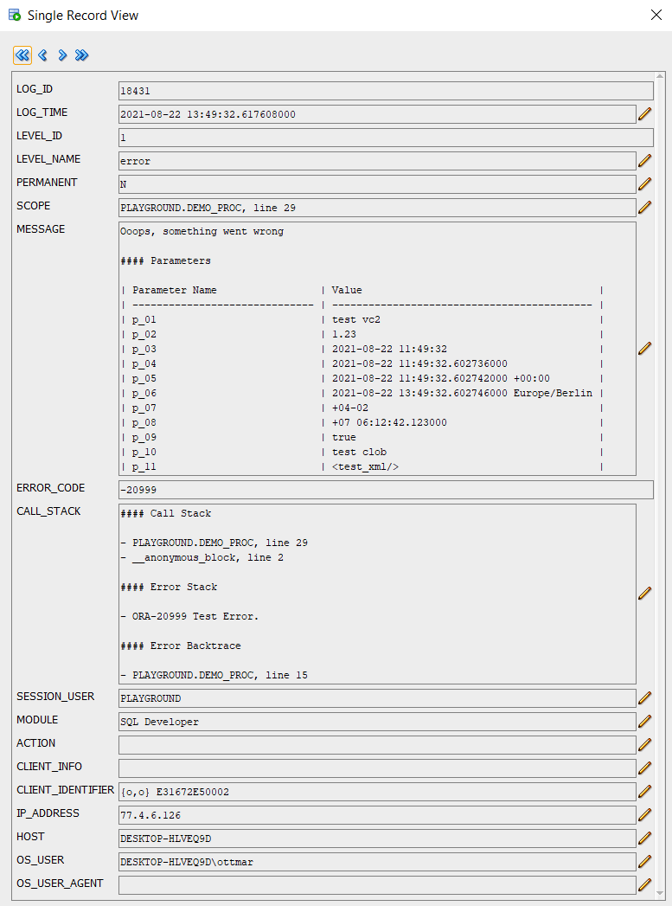
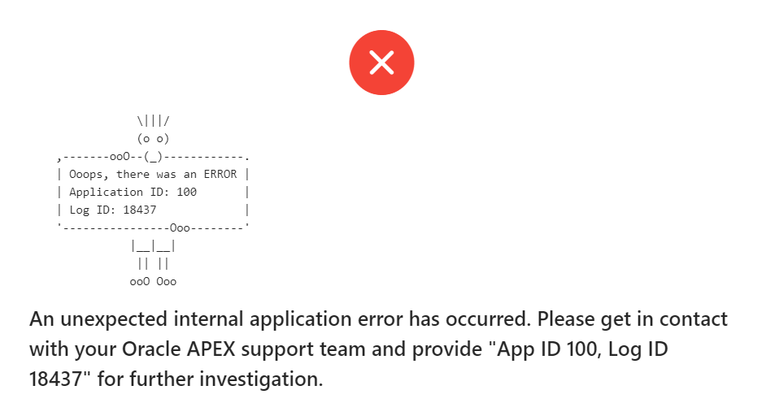

<!-- nav -->

[Index](README.md)
| [Installation](installation.md)
| [Introduction](introduction.md)
| [API Overview](api-overview.md)
| [Package Console](package-console.md)
| [Changelog](changelog.md)
| [Uninstallation](uninstallation.md)

<!-- navstop -->

# Introduction

After you have [installed the console objects](installation.md) you can start to
use it to instrument your code.

The following introduction is a copy of [this blog
post](https://ogobrecht.com/posts/2021-10-03-ein-weiteres-oracle-db-logging-tool-console/).

<!-- toc -->

- [A single install script](#a-single-install-script)
- [Production safe without further configuration](#production-safe-without-further-configuration)
- [Method names based on JavaScript Console](#method-names-based-on-javascript-console)
- [Reduced amount of log entries through saved call stack](#reduced-amount-of-log-entries-through-saved-call-stack)
- [Simple logging of method parameters](#simple-logging-of-method-parameters)
- [Markdown format for automatically determined metadata](#markdown-format-for-automatically-determined-metadata)
- [Extensible logs through overloaded log methods](#extensible-logs-through-overloaded-log-methods)
- [Measure time and count things](#measure-time-and-count-things)
- [Assert, format and other helpers](#assert-format-and-other-helpers)
- [Displaying the package status of Console in a session](#displaying-the-package-status-of-console-in-a-session)
- [APEX Error Handling Function](#apex-error-handling-function)
- [APEX Plug-In for capturing frontend errors](#apex-plug-in-for-capturing-frontend-errors)
- [Sources of inspiration](#sources-of-inspiration)

<!-- tocstop -->

It looks like it is a hobby of PL/SQL developers to develop their own logging
tool. There are already some free tools on the market and probably many that
have never been released ([DOAG talk by Sabine Heimsath on the
topic](https://www.doag.org/formes/pubfiles/10101682/2018-SQLPLSQL-Sabine_Heimsath-PL_SQL__Monitoren__gt__Messen__gt__Optimieren_-_mit_Open_Source-Praesentation.pdf)):

- [Logger](https://github.com/OraOpenSource/Logger)
- [PIT](https://github.com/j-sieben/PIT/)
- [Instrumentation for PLSQL](https://github.com/connormcd/instrumentation)
- [Log4plsql](https://github.com/alangibson/log4plsql)
- [ILO](https://sourceforge.net/projects/ilo/)
- [BMC_DEBUG](https://sites.google.com/site/oraplsqlinst/)
- ...

One reason seems to be that everyone has different ideas or needs. For me, I
wanted a logging tool that is very easy to install and works even if you are not
allowed to create a context in the database and also have no special read
permissions for administrative views like v$session. You only need the rights to
create tables and packages and optionally a cleanup job - pretty standard.
Nevertheless, it is possible to move individual users/sessions to a higher log
level for debugging purposes. As this is solved via client identifier, this will
also work in an environment without fixed session ID like e.g. APEX. If no
client identifier is set in an environment, then Console simply assigns one
itself. Console reads its configuration from a table with only one line
supported by the result cache. This ensures a resource-saving execution. Also
the check whether a log message is really written to the log table based on the
current log level is highly optimized to keep the overhead as low as possible in
production environments.

## A single install script

For Console, all scripts are merged into a single install script. Since SQLcl
can also load scripts from the Internet, you could install the tool in a minute
without downloading it first: Invoke SQLcl, log into the desired schema, and
call
`@https://raw.githubusercontent.com/ogobrecht/console/main/install/create_console_objects.sql`.
A few seconds later you can start logging. If you want to install it in APEX and
only have browser access to your development environment, the single install
script in SQL Workshop is also very helpful and Console installs quickly.

## Production safe without further configuration

Console logs only errors (level 1) by default. This means that you are on the
safe side on production systems without any further configuration. But if you
want to enable other levels like warning (2), info (3), debug (4) or trace (5)
on a development system and don't want to do this for each session individually,
you can set it globally: `exec console.conf(p_level => 3);`. More about this in
the package description for the procedure
[console.conf](package-console.md#procedure-conf).

To set a session (client identifier) to a higher log level use the procedure
[console.init](package-console.md#procedure-init). If you omit the parameter
`p_client_identifier`, then the client identifier of your own session is
automatically taken - here is an example:

```sql
-- Dive into your own session with the default log level of 3 (info) and the
-- default duration of 60 (minutes).
exec console.init;

-- With level 4 (debug) for the next 15 minutes.
exec console.init(4, 15);

-- Using a constant for the level
exec console.init(console.c_level_debug, 90);

-- Debug an APEX session...
begin
  console.init(
    p_client_identifier => 'OGOBRECHT:8805903776765',
    p_level             => console.c_level_debug,
    p_duration          => 15
    -- there are more parameters availabe...
  );
end;
/
```

Now the question arises, how to get the client identifier of a foreign session
without read access to adminstrative views like e.g. v$session. A variant would
be to write this for example in the frontend of an application with
`sys_context('USERENV', 'CLIENT_IDENTIFIER')` - e.g. in the footer or on a help
page.

If you want to return to the normal mode of global settings for all sessions,
you can do so with [console.exit](package-console.md#procedure-exit).

You should not use the procedures `console.conf`, `init` and `exit` in your
business logic - they are only used for managing session settings and for
debugging purposes and should therefore only be used interactively or in SQL
scripts.

## Method names based on JavaScript Console

Console uses as many method names from the JavaScript Console as possible - so
switching between backend code and frontend code shouldn't be that hard as far
as method names are concerned. Whether the methods really write anything to the
log table CONSOLE_LOGS depends on the active log level - so first these:

- Level 1: Error
- Level 2: Warning
- Level 3: Info
- Level 4: Debug (instead of verbose in the JavaScript Console)
- Level 5: Trace (not available in the JavaScript Console)

The main instrumentation methods:

- console.error_save_stack (more on that in a moment):
- console.error (level error)
- console.warn (level warning)
- console.info & log (level info)
- console.debug (level debug)
- console.trace (level trace)
- console.count & count_reset
- console.count_current & count_end (level info)
- console.count_current & count_end (function overloads, independent of log level)
- console.time & time_reset
- console.time_current & time_end (level info)
- console.time_current & time_end (function overloads, independent of log level)
- console.table# (level info)
- console.assert & assertf
- console.format
- console.add_param

More in the [API overview](api-overview.md).

## Reduced amount of log entries through saved call stack

Console uses the capabilities of the `utl_call_stack` package to reduce the
number of log entries to a possible minimum. Who doesn't know the problem: In
case of an error, a log entry is created in each sub-function to record as many
details as possible. In the end you have to watch how the log table gets
cluttered and you try to find out from the many log entries where exactly the
error occurred.

It would be helpful to see the method names in the error backtrace - but the
database only writes the package names and the line number in the backtrace. To
work around this problem Console offers the possibility instead of writing an
error in the submethods into the log table, to save the call stack with the call
`console.error_save_stack` until finally in the outermost main method
`console.error` is called, which then enters the error including saved call
stack into the log table. For clarification, here is a script with a test
package:

```sql
set define off
set feedback off
set serveroutput on
set linesize 120
set pagesize 40
column call_stack heading "Call Stack" format a120
whenever sqlerror exit sql.sqlcode rollback

prompt TEST ERROR_SAVE_STACK

prompt - compile package spec
create or replace package some_api is
  procedure do_stuff;
end;
/

prompt - compile package body
create or replace package body some_api is
------------------------------------------------------------------------------
    procedure do_stuff is
    --------------------------------------
        procedure sub1 is
        --------------------------------------
            procedure sub2 is
            --------------------------------------
                procedure sub3 is
                begin
                  console.assert(1 = 2, 'Demo');
                exception --sub3
                  when others then
                    console.error_save_stack;
                    raise;
                end;
            --------------------------------------
            begin
              sub3;
            exception --sub2
              when others then
                console.error_save_stack;
                raise;
            end;
        --------------------------------------
        begin
          sub2;
        exception --sub1
          when others then
            console.error_save_stack;
            raise no_data_found;
        end;
    --------------------------------------
    begin
      sub1;
    exception --do_stuff
      when others then
        console.error;
        raise;
    end;
------------------------------------------------------------------------------
end;
/

prompt - call the package
begin
  some_api.do_stuff;
exception
  when others then
    null; --> I know, I know, never do that without a final raise...
          --> But we want only test our logging without killing the script run...
end;
/

prompt - FINISHED, selecting now the call stack from the last log entry...

select call_stack from console_logs order by log_id desc fetch first row only;
```

Here is the output of the above script - the Saved Error Stack section is
Console's special feature, the other three stack and trace sections are the
database's standards:

```bash
TEST ERROR_SAVE_STACK
- compile package spec
- compile package body
- call the package
- FINISHED, selecting now the call stack from the last log entry...

Call Stack
------------------------------------------------------------------------------------------------------------------------
#### Saved Error Stack

- PLAYGROUND.SOME_API.DO_STUFF.SUB1.SUB2.SUB3, line 14 (line 11, ORA-20777 Assertion failed: Demo)
- PLAYGROUND.SOME_API.DO_STUFF.SUB1.SUB2, line 22 (line 19)
- PLAYGROUND.SOME_API.DO_STUFF.SUB1, line 30 (line 27)
- PLAYGROUND.SOME_API.DO_STUFF, line 38 (line 35, ORA-01403 no data found)

#### Call Stack

- PLAYGROUND.SOME_API.DO_STUFF, line 38
- __anonymous_block, line 2

#### Error Stack

- ORA-01403 no data found
- ORA-06512 at "PLAYGROUND.SOME_API", line 31
- ORA-20777 Assertion failed: Test assertion with line break.
- ORA-06512 at "PLAYGROUND.SOME_API", line 23
- ORA-06512 at "PLAYGROUND.SOME_API", line 15
- ORA-06512 at "PLAYGROUND.CONSOLE", line 750
- ORA-06512 at "PLAYGROUND.SOME_API", line 11
- ORA-06512 at "PLAYGROUND.SOME_API", line 19
- ORA-06512 at "PLAYGROUND.SOME_API", line 27

#### Error Backtrace

- PLAYGROUND.SOME_API, line 31
- PLAYGROUND.SOME_API, line 23
- PLAYGROUND.SOME_API, line 15
- PLAYGROUND.CONSOLE, line 750
- PLAYGROUND.SOME_API, line 11
- PLAYGROUND.SOME_API, line 19
- PLAYGROUND.SOME_API, line 27
- PLAYGROUND.SOME_API, line 35
```

If you don't use `console.error_save_stack` but always `console.error`, then you
get at least the last three sections in the log - and without extra work in the
code. You just have to remember `console.error`.

## Simple logging of method parameters

Console also provides a simple way to log method parameters. Here is a sample
procedure with parameters of all supported types:

```sql
--create demo procedure
create or replace procedure demo_proc (
  p_01 varchar2                       ,
  p_02 number                         ,
  p_03 date                           ,
  p_04 timestamp                      ,
  p_05 timestamp with time zone       ,
  p_06 timestamp with local time zone ,
  p_07 interval year to month         ,
  p_08 interval day to second         ,
  p_09 boolean                        ,
  p_10 clob                           ,
  p_11 xmltype                        )
is
begin
  raise_application_error(-20999, 'Test Error.');
exception
  when others then
    console.add_param('p_01', p_01);
    console.add_param('p_02', p_02);
    console.add_param('p_03', p_03);
    console.add_param('p_04', p_04);
    console.add_param('p_05', p_05);
    console.add_param('p_06', p_06);
    console.add_param('p_07', p_07);
    console.add_param('p_08', p_08);
    console.add_param('p_09', p_09);
    console.add_param('p_10', p_10);
    console.add_param('p_11', p_11);
    console.error('Ooops, something went wrong');
    raise;
end demo_proc;
/
```

In the exception handling you can see nicely that you always call the same
procedure `console.add_param` and pass the name and the value. The parameters
are cached in an array in the console package (shortened to a maximum of 2000
characters) and taken over with the next call of a log method (error, warn,
info, log, debug or trace). If you don't want the parameters to be truncated,
you are free to write the parameter directly into the log message - this is of
type clob and is therefore not subject to any size restrictions.

Here an example call of the above procedure:

```sql
begin
  demo_proc (
    p_01 => 'test vc2'                             ,
    p_02 => 1.23                                   ,
    p_03 => sysdate                                ,
    p_04 => systimestamp                           ,
    p_05 => systimestamp                           ,
    p_06 => localtimestamp                         ,
    p_07 => interval '4-2' year to month           ,
    p_08 => interval '7 6:12:42.123' day to second ,
    p_09 => true                                   ,
    p_10 => to_clob('test clob')                   ,
    p_11 => xmltype('<test_xml/>')                 );
end;
/
```

This call then writes the following log message - see the MESSAGE column:



## Markdown format for automatically determined metadata

The attentive reader might not have missed that the above log message is
formatted in Markdown. So, if you like, you can have your report rendered
accordingly in HTML (e.g. in APEX) - however, it is well readable in text form,
too. The Markdown table format as in the example above is also used by Console
for logging other metadata such as APEX environment, CGI environment, user
environment and console environment. All of these environments can be turned on
for each individual log call. They are then appended to the log message like the
parameters. Here exemplarily the signature of the error procedure:

```sql
procedure error (
  p_message         in clob     default null  , -- The log message itself
  p_permanent       in boolean  default false , -- Should the log entry be permanent (not deleted by purge methods)
  p_call_stack      in boolean  default true  , -- Include call stack
  p_apex_env        in boolean  default false , -- Include APEX environment
  p_cgi_env         in boolean  default false , -- Include CGI environment
  p_console_env     in boolean  default false , -- Include Console environment
  p_user_env        in boolean  default false , -- Include user environment
  p_user_agent      in varchar2 default null  , -- User agent of browser or other client technology
  p_user_scope      in varchar2 default null  , -- Override PL/SQL scope
  p_user_error_code in integer  default null  , -- Override PL/SQL error code
  p_user_call_stack in varchar2 default null    -- Override PL/SQL call stack
);
```

## Extensible logs through overloaded log methods

The error procedure has an overload in the form of a function that returns the
log ID. Thus one can extend the logging also with own data in own tables e.g.
for a downstream release process in case of specific errors. This is also the
purpose of the `p_permanent` parameter, which ensures that the cleanup job or
the `console.purge` and `console.purge_all` procedures do not delete the
correspondingly marked log entries and that these are permanently available. All
other log methods (warn, info, log, debug, trace) are implemented in the same
way and with the same parameters - but some have different default values. For
the error method the call stack is written, for the trace method all four
environment details.

The parameters `p_user_agent`, `p_user_scope`, `p_user_error_code` and
`p_user_call_stack` are intended to be able to capture external log events as
well and to overwrite the automatically determined values of the PL/SQL
environment. As an example an external load process in a data warehouse or error
messages from the JavaScript frontend of an application can be mentioned. With a
little imagination, everyone will come up with their own use cases here...

## Measure time and count things

Measuring execution times and counting things are very common functions. Console
can help here to not have to create too many helper variables and keep the code
short and sweet. For this purpose it offers the procedures `time`, `count` and
other helpers. You can easily run several timers or counters in parallel - they
are each identified by an optional label. If you omit the label, then internally
the label is `default`. The best way to illustrate this is a bit of sample code:

```sql
begin
  --basic usage
  console.time;
  sys.dbms_session.sleep(0.1);
  console.time_end; -- without optional label and message

  console.time('myTimer');
  sys.dbms_session.sleep(0.1);
  console.time_current('myTimer'); -- without optional message

  sys.dbms_session.sleep(0.1);
  console.time_current('myTimer', 'end of step two');

  sys.dbms_session.sleep(0.1);
  console.time_end('myTimer', 'end of step three');
end;
/
```

This will result in the following log messages in the console_logs table if the
current log level is 3 (info) or higher:

- default: 00:00:00.102508
- myTimer: 00:00:00.108048
- myTimer: 00:00:00.212045 - end of step two
- myTimer: 00:00:00.316084 - end of step three

But sometimes you don\`t want to have prefabricated log entries or you need the
elapsed time to write them in scripts to the server output. For this purpose the
procedures `time_current` and `time_end` used in the code are also available as
overloaded functions. With these you can do what you want:

```sql
set serveroutput on

begin
  console.time;

  --console.print is an alias for sys.dbms_output.put_line
  console.print('Processing step one...');
  sys.dbms_session.sleep(0.1);
  console.print('Elapsed: ' || console.time_current);

  console.print('Processing step two...');
  sys.dbms_session.sleep(0.1);
  console.print('Elapsed: ' || console.time_current);

  console.print('Processing step three...');
  sys.dbms_session.sleep(0.1);
  console.print('Elapsed: ' || console.time_end);
end;
/
```

This then leads to something like this server output:

```bash
Processing step one...
Elapsed: 00:00:00.105398
Processing step two...
Elapsed: 00:00:00.209267
Processing step three...
Elapsed: 00:00:00.313301
```

For counting things or processes there are the same procedures and functions as
for time measurements - only with the prefix `count` instead of `time` (we use
the variant without label in the example):

```sql
set serveroutput on

begin
  console.print('Counting nonsense...');

  for i in 1 .. 1000 loop
    if mod(i, 3) = 0 then
      console.count;
    end if;
  end loop;
  console.print('Current value: ' || console.count_current );

  console.count_reset;

  for i in 1 .. 10 loop
    console.count;
  end loop;
  console.print('Final value: ' || console.count_end );
end;
/
```

This then results in a server output as follows:

```bash
Counting nonsense...
Current value: 333
Final value: 10
```

The `count_reset` procedure used in the example also exists for timers and is
called `time_reset` there. The respective `*_end` methods delete the entry from
the list of timers/counters managed in the console package.

## Assert, format and other helpers

There are other auxiliary methods that make the developer's life more pleasant.
First of all, the assert procedure should be mentioned. Everyone should know
this recurring pattern:

```sql
if not x < y then
  raise_application_error(-20999, 'X should be less than Y');
else
  -- your code here
end if;
```

It gets especially ugly when you have to check multiple conditions. The whole
thing can also be formulated as a one-liner:

```sql
console.assert(x < y, 'x should be less then y');
```

If you want to enrich texts with dynamic information, then you are quickly in
concatenation hell:

```sql
console.assert(
  x < y,
  'x should be less then y (x='
  || to_char(x)
  || ', y='
  || to_char(y)
  || ')'
);
```

Here the `format` function can help you:

```sql
console.assert(
  x < y,
  console.format(
    'x should be less then y (x=%s, y=%s)',
    to_char(x),
    to_char(y)
  )
);
```

`format` accepts up to 10 parameters and works according to the following rules:

1. replace all occurrences of `%0` ... `%9` with the corresponding parameters
   `p0` ... `p9`
2. replace `%n` with new lines (line feed character)
3. replace all occurrences of `%s` in positional order with the corresponding
   parameters with sys.utl_lms.format_message - see also the [Oracle
   docs](https://docs.oracle.com/en/database/oracle/oracle-database/19/arpls/UTL_LMS.html#GUID-88FFBFB6-FCA4-4951-884B-B0275BD5DF44)

I personally am very reluctant to type `sys.dbms_output.put_line`. Console does
write to a log table with all the log methods, but actually the word console
suggests that we can also write directly to the server output, right? For that
we have the procedure `print`:

```sql
console.print('A message');
```

Then there are the short forms of `console.print(console.format(...))` and
`console.assert([boolean expression], console.format(...))`:

```sql
console.printf(
  'A dynamic message with a %n second line of text: %s',
  my_var
);

console.assertf(
  x < y,
  'x should be less then y (x=%s, y=%s)',
  to_char(x),
  to_char(y)
);
```

Also often needed is a fast, cached clob concatenation - that's where Console
can help with [clob_append](package-console.md#procedure-clob_append) &
[clob_flush_cache](package-console.md#procedure-clob_flush_cache).

More can be found in the [API overview](api-overview.md).

## Displaying the package status of Console in a session

If you are interested in what is configured in the current session of Console,
you can look at it with a pipelined table function or make it available in your
application with a report:

```sql
select * from table(console.status);
```

| ATTRIBUTE                | VALUE               |
|--------------------------|---------------------|
| c_version                | 1.0.0               |
| localtimestamp           | 2021-10-03 13:58:00 |
| sysdate                  | 2021-10-03 11:58:00 |
| g_conf_check_sysdate     | 2021-10-03 11:58:10 |
| g_conf_exit_sysdate      | 2021-10-03 12:58:00 |
| g_conf_client_identifier | {o,o} 11ECD3500002  |
| g_conf_level             | 5                   |
| level_name(g_conf_level) | trace               |
| g_conf_check_interval    | 10                  |
| g_conf_enable_ascii_art  | true                |
| g_conf_call_stack        | false               |
| g_conf_user_env          | false               |
| g_conf_apex_env          | false               |
| g_conf_cgi_env           | false               |
| g_conf_console_env       | false               |
| g_counters.count         | 1                   |
| g_timers.count           | 2                   |
| g_saved_stack.count      | 0                   |
| g_prev_error_msg         |                     |

## APEX Error Handling Function

For APEX, Console comes with a so-called "[Error Handling
Function](https://docs.oracle.com/en/database/oracle/application-express/20.2/aeapi/Example-of-an-Error-Handling-Function.html#GUID-2CD75881-1A59-4787-B04B-9AAEC14E1A82)"
which can enter errors within the APEX runtime environment into the log table.
If you want to use this, you have to enter this function in your application in
the "Application Builder" under "Edit Application Properties > Error Handling >
Error Handling Function": `console.apex_error_handling`.



*Screenshot above: APEX error handling with ASCII art enabled*

The Error Handling Function logs the technical error in the CONSOLE_LOGS table
and writes a friendly message to the end user. It uses the APEX Text Message
feature for the user-friendly messages in case of constraint violations, as
described in [this video](https://www.insum.ca/episode-22-error-handling/) by
Anton and Neelesh from Insum, which in turn is based on an idea by Roel Hartman
in [this blog
post](https://roelhartman.blogspot.com/2021/02/stop-using-validations-for-checking.html).
The APEX community rocks....

## APEX Plug-In for capturing frontend errors

Furthermore, there is an APEX Dynamic Action Plug-In, which enters JavaScript
errors in the user's browser via AJAX call into the log table. This way you also
get to know if the frontend is not running smoothly for the users...

You have to make sure that Console is either installed in the parsing schema of
the application or a synonym named CONSOLE has been created in the parsing
schema which points to the package CONSOLE. Then you can install the plug-in in
`install/apex_plugin.sql` and create a Dynamic Action for the whole application
on page zero:

- Event: Page Load
- Action: Oracle Instrumentation Console [Plug-In]
- No further customization required (only a JavaScript file will be loaded)

For those interested in what the plug-in does: `sources/apex_plugin_console.js`.
This is currently a minimal implementation and may be improved in the future.

## Sources of inspiration

I am not alone in the world and without the others not much goes in software
development. Here are a few links to sites or projects that inspired me on the
way to my own logging tool:

- [JavaScript Console
  API](https://developers.google.com/web/tools/chrome-devtools/console/api)
- [Logger](https://github.com/OraOpenSource/Logger)
- [Instrumentation for PLSQL](https://github.com/connormcd/instrumentation)
- [PIT](https://github.com/j-sieben/PIT/)
- [Oracle Magazine - Sophisticated Call Stack
  Analysis](https://blogs.oracle.com/oraclemagazine/post/sophisticated-call-stack-analysis)

Special thanks to [Dietmar Aust](https://twitter.com/daust_de), who gave me time
and ideas with a discussion session at an early stage.

Happy logging and debugging :-)

Ottmar
